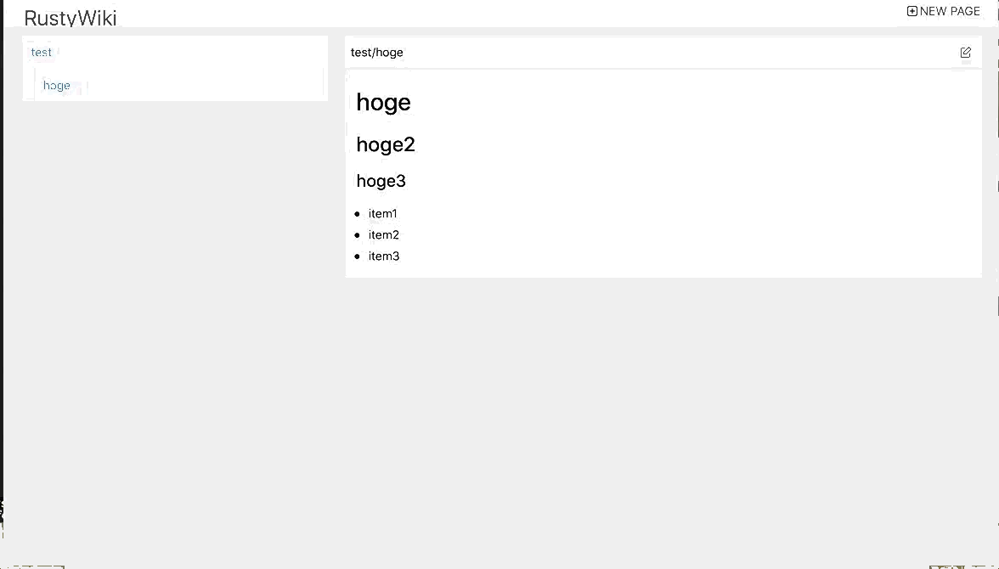
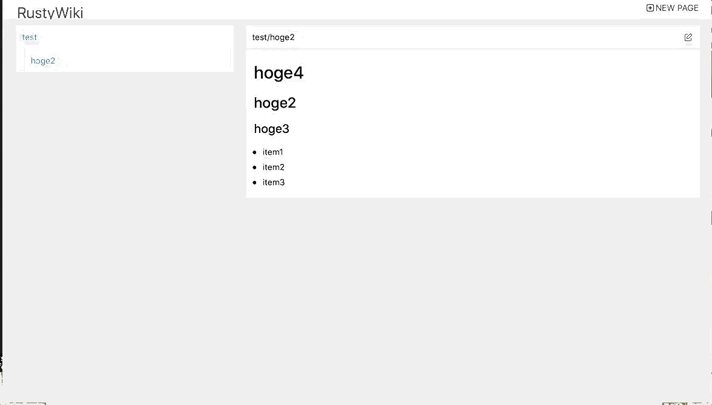

# RustyWiki
Wiki implemented by Rust (both client-side and server-side).  
**This project is only for my personal experiment. Please DO NOT use in production.**

## Screen shots

### Create page

### Update page

### delete page

## Quick Start
You can use docker-compose for quick look.

1.  `docker-compose up`
2. Access to http://localhost:8000 .

## License

Licensed under either of these:

 * Apache License, Version 2.0, ([LICENSE-APACHE](LICENSE-APACHE) or
   https://www.apache.org/licenses/LICENSE-2.0)
 * MIT license ([LICENSE-MIT](LICENSE-MIT) or
   https://opensource.org/licenses/MIT)
